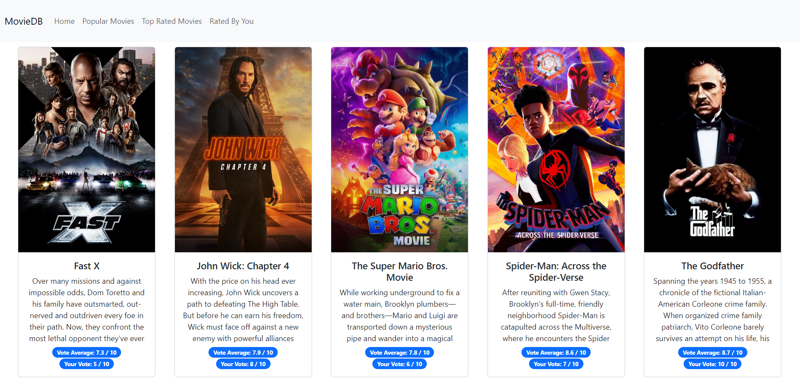
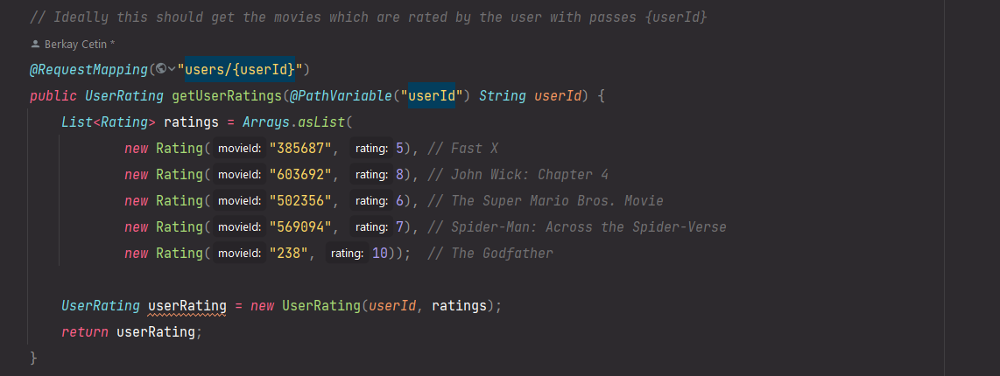
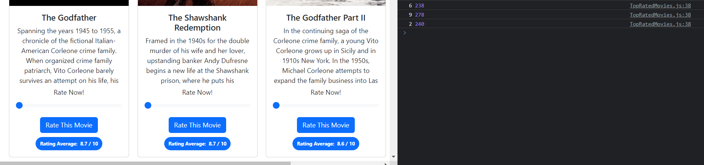
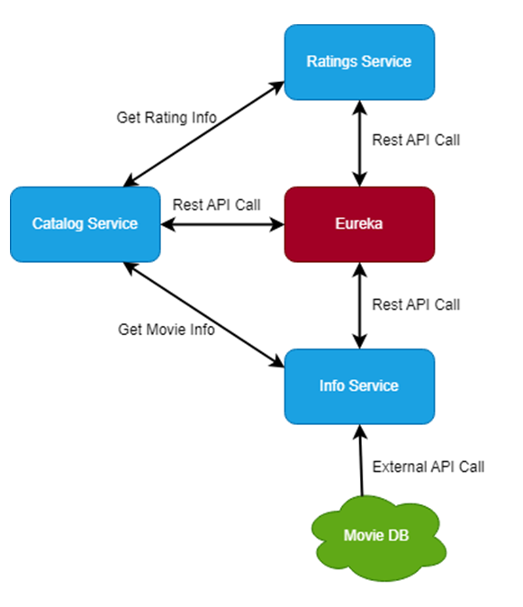

# MicroserviceBasedMovieCatalog
This project is a collaborative group project aiming to develop a demo application of a microservice-based movie catalog, where Spring Boot is used on the back-end and React.js is used on the front-end.

## How to run?
To run the project, follow these steps:

1. Clone the project to your local machine.
2. Open the "movie-catalog-microservices" project in an IDE of your choice (IntelliJ IDEA and Java 11 were used in this project).
3. Individually execute each service within the project.
4. Open the "frontend-microservices" project in a development environment of your choice (Visual Studio Code was used in this project).
5. Install `node_modules` for the front-end by running `npm install` command.
6. Launch the front-end project by running the command `npm start`.
7. After completing these steps, you can navigate through the application as desired.

## Overview
When the project is first initiated, you encounter the following screen:

When you navigate to the Popular Movies page, based on the data obtained from TMDB API, you can access movies in a paginated format along with brief information about them and sections for voting on the films. (You will find similar elements on the Top Rated Movies page as well, allowing you to explore top-rated films instead.)

If you desire to view different movies, you can change the pages from here when you reach the end of the page. (You can see the same option on Top Rated Movies page)

On the Rated By You page, you can see movies that have been rated by users, and the information about the movies is also obtained from the TMDB API in the same manner.

Since this application is currently a demo application and does not have a dedicated database, the information regarding these movies has been hard-coded on the back-end side.

However, for future developments and convenience, during the voting process on the Popular Movies and Top Rated Movies pages, the ratings given to the movies bu user and their corresponding IDs are returned to be used in the TMDB API.

## Project architecture

