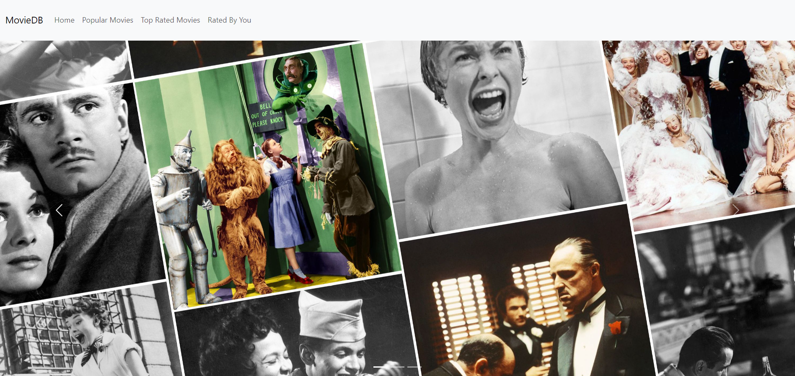
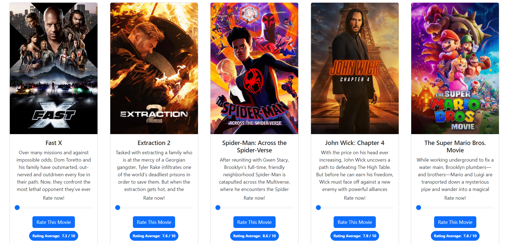
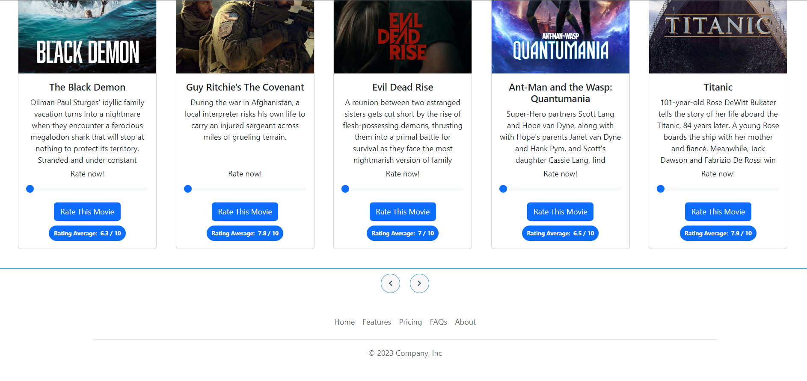
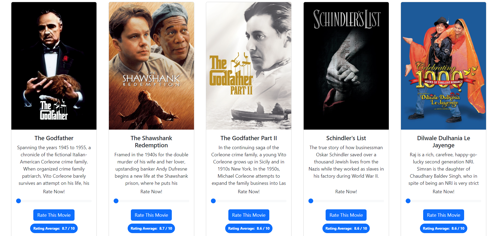

# MicroserviceBasedMovieCatalog
A demo application of a microservice-based movie catalog, where Spring Boot is used on the back-end and React.js is used on the front-end.

## How to run?
To run the project, follow these steps:

1. Clone the project to your local machine.
2. Open the "movie-catalog-microservices" project in an IDE of your choice (IntelliJ IDEA and Java 11 were used in this project).
3. Individually execute each service within the project.
4. Open the "frontend-microservices" project in a development environment of your choice (Visual Studio Code was used in this project).
5. Install the necessary dependencies for the frontend by running `npm install` command.
6. Launch the frontend project by running the command `npm start`.
7. After completing these steps, you can navigate through the application as desired.

## Overview
When the project is first initiated, you encounter the following screen:

When you navigate to the Popular Movies page, based on the data obtained from TMDB API, you can access movies in a paginated format along with brief information about them and sections for voting on the films.

If you desire to view different movies, you can change the pages from here when you reach the end of the page. (You can see the same option on Top Rated Movies page)

When you navigate to the Top Rated Movies page, based on the data obtained from TMDB API, you can access movies in a paginated format along with brief information about them and sections for voting on the films.

